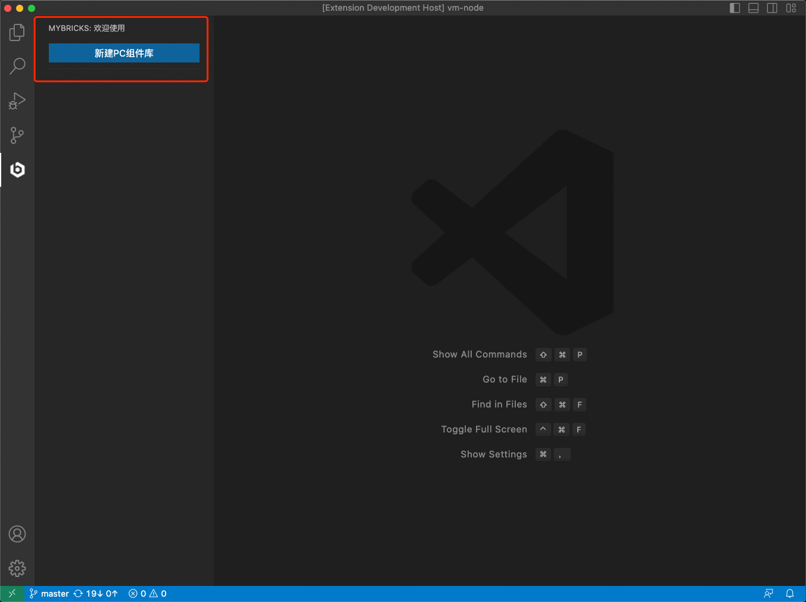
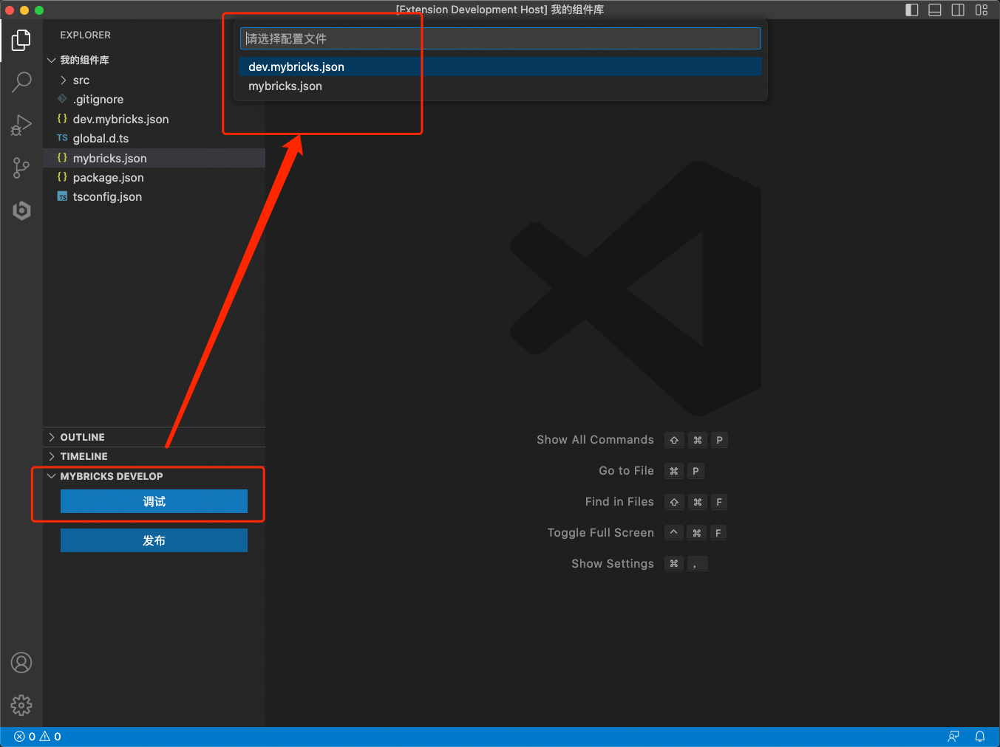
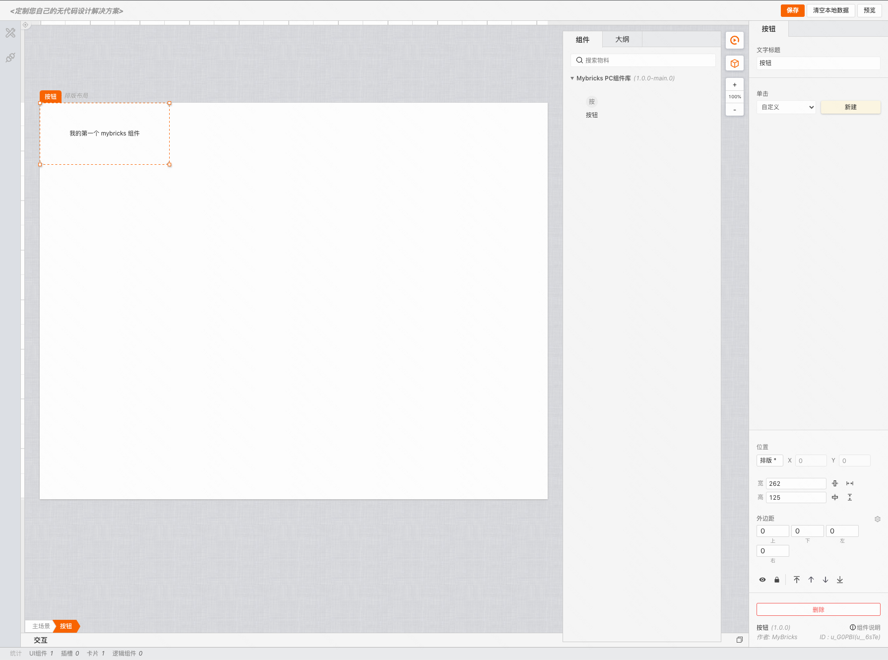

# 快速开始

>需要保证已安装 VSCode，并确保 VSCode 版本是 1.71.0 或以上。

## 安装插件
>[去安装](https://marketplace.visualstudio.com/items?itemName=Mybricks.Mybricks)

## 创建组件库
点击 VS Code 界面左侧活动栏上的「MyBricks 图标」，新建一个PC组件库。

## 调试
当项目下有 **mybricks.json** 配置文件时，就能够看到 **MYBRICKS DEVELOP** 面板，点击调试，选择需要调试的配置文件即可。

这里的调试，其实是启动了webpack服务，当编译完成后会打开浏览器，接下来就可以开始编写属于自己的组件了。

